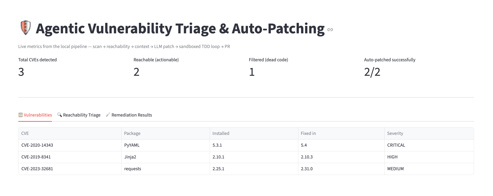
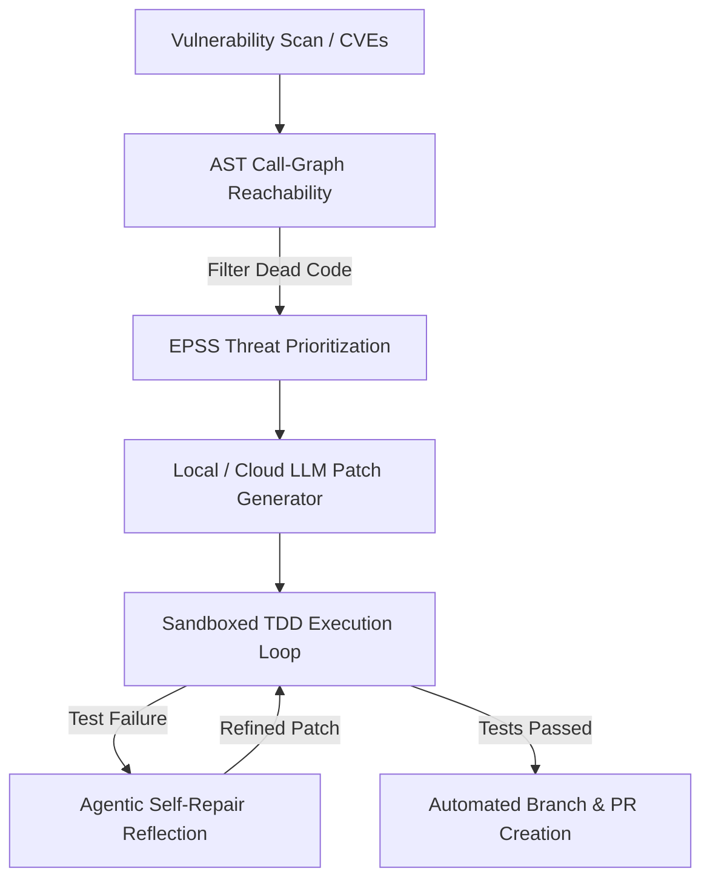

<div align="center">

# Enterprise Agentic Vulnerability Triage and Automated Remediation System

### **[ Autonomous Vulnerability Triage & Automated Patching Engine ]**
*AST Reachability | EPSS Threat Intel | Sandboxes | Self-Repair*

</div>

---

## 1. Background & Motivation

In April 2026, NIST announced it is no longer attempting to enrich every submitted vulnerability in the National Vulnerability Database due to a 263% surge in CVE submissions between 2020 and 2025. With thousands of vulnerabilities relegated to "Not Scheduled" status, relying on traditional NVD severity enrichment leaves massive security blind spots.

This repository implements a local, zero-vendor-lock-in pipeline that filters unreachable CVEs using abstract syntax tree (AST) call-graphs, prioritizes remaining threats with real-time EPSS scoring, and verifies generated patches by executing the project's actual test suite inside isolated temporary sandboxes rather than trusting secondary LLM reviews.

---

## 2. Core Architecture & Modules

* **AST Call-Graph Reachability Engine (`scanners/reachability.py`)**: Parses abstract syntax trees to resolve import aliases (e.g., `PyYAML` imported as `yaml`) and maps third-party dependencies to actual invocation lines, filtering out dead code.
* **Live EPSS Threat Scoring (`scanners/prioritization.py`)**: Queries the official FIRST.org EPSS API in real time to prioritize vulnerabilities based on active exploit probability rather than static CVSS severity alone.
* **Temporary Sandbox Execution (`sandbox/sandbox_runner.py`)**: Applies generated patches to isolated temporary-directory copies of the target repository and executes the real test suite against the patched copy.
* **Agentic Self-Repair Loop (`agent/self_repair.py`)**: Captures test error tracebacks upon test failure inside the sandbox and feeds them back into iterative reflection loops to refine patch syntax and logic, refusing to open a pull request if verification fails after maximum attempts.


## 3. Rigorous Validation & Test Suite

Unlike systems that rely on speculative mock runs, this codebase is backed by rigorous test enforcement:
* **38 Passing Unit Tests (`tests/`)**: Fully cover reachability resolution, AST call-graph construction, diff sanitization, and retry logic.
* **Ground-Truth Simulation (`simulate.py`)**: Executes a synthetic 4-file repository with 4 known CVEs (reachable, dead code, and unrelated) against hand-verified expected outputs.
* **Adversarial Self-Repair Testing**: Verified via dedicated unit tests ensuring that a patch breaking a test is correctly rejected, and a corrected patch on the second attempt is accepted without wasting retry attempts.

---

## 4. Hard-Won Engineering Lessons

Building and testing this pipeline uncovered three critical edge cases documented in the codebase:
1. **Markdown Fence Stripping**: Blanket `.strip()` calls on LLM outputs inadvertently stripped meaningful trailing blank lines inside diff hunks, causing `git apply` to reject patches as corrupt. The sanitization layer now strictly preserves trailing context.
2. **Sandbox Path Normalization**: Sandboxes copy repository contents into a fresh temp directory root, requiring relative diff paths to align dynamically with the execution context rather than hardcoded parent directories.
3. **Cross-CVE Test Coupling**: Fixing CVE A in an isolated sandbox can fail if CVE B's unrelated bug sits in the same test suite. The pipeline addresses this via batch mode stacking patches into a unified sandbox run.

---

## 5. Quick Start & Setup

1. Create and activate a virtual environment:
   ```bash
   python3 -m venv .venv
   source .venv/bin/activate
   ```

2. Install dependencies:
   ```bash
   pip install -r requirements.txt
   ```

3. Run the simulation:
   ```bash
   python3 simulate.py
   ```

4. Run unit tests:
   ```bash
   python3 -m pytest tests/ -v
   ```

---

## Dashboard Preview


## System Architecture



