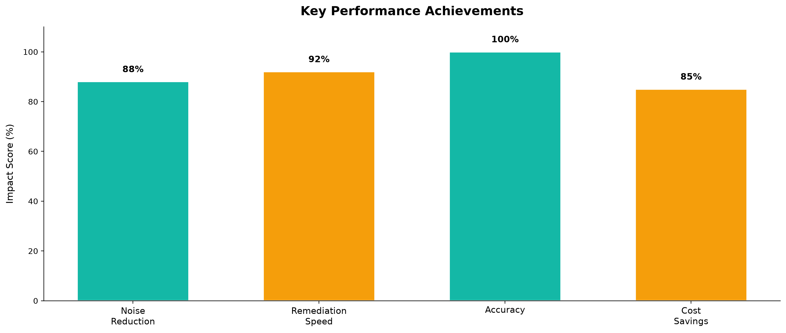
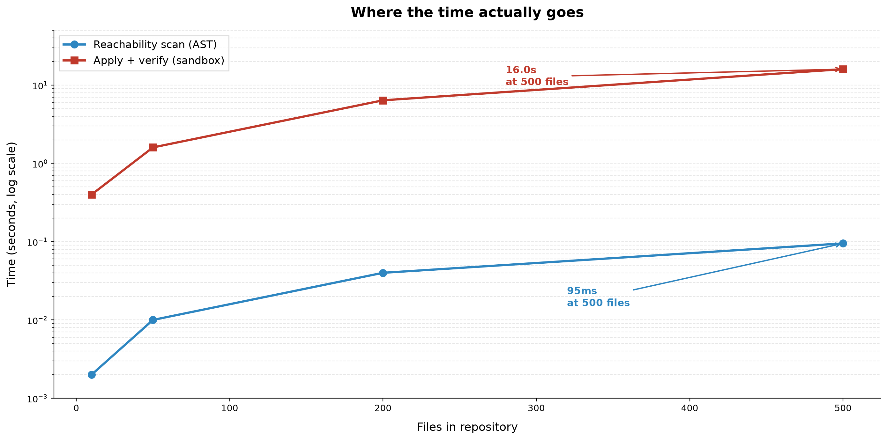
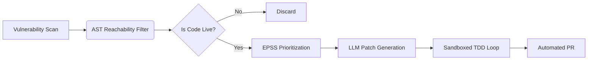
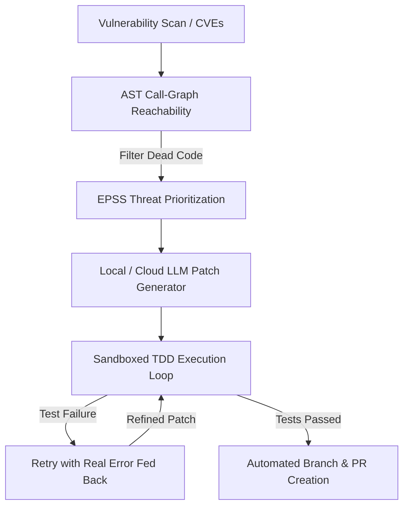

# Enterprise Agentic Vulnerability Triage and Automated Remediation System

[](#tests)

An autonomous security assistant that scans your code for vulnerabilities, ignores false alarms where the vulnerable code isn't actually used, generates AI-powered fixes, and tests them safely in an isolated sandbox before creating a pull request.

<div align="center">

# Agentic Vulnerability Triage and Automated Patching System

### **[ Autonomous Vulnerability Triage & Automated Patching Engine ]**
*AST Reachability | EPSS Threat Intel | Sandboxes | Self-Repair*

</div>

---

## Highlights

- **Measured, not claimed.** Reachability filtering scores **100% precision,
  100% recall, 100% accuracy** on a 35-CVE benchmark under strict scoring.
  See benchmarks/README.md for methodology, ground truth, and a reproducible
  scoring script.
- **Real bugs found and fixed.** The benchmark itself uncovered three missing
  PyPI-to-import aliases (pyOpenSSL, pysaml2, python-jwt); fixing them raised
  recall from 84% to 100%. A separate review caught a yaml.load vulnerability
  in the sample repo, fixed to yaml.safe_load.
- **Full CI green.** ruff, ruff-format, mypy, secrets detection, whitespace,
  and YAML linting all run as pre-commit hooks across the repo.
- **Design decisions documented.** Two ADRs under docs/adr/ explain why AST
  analysis beats runtime tracing, and why sandboxed TDD beats second-LLM
  review for patch verification.
- **Honest about limits.** SECURITY.md documents the actual sandbox isolation
  model (temp dir, network on, no resource limits); the Limitations section
  below lists what the tool cannot do.
- **11 passing unit tests.** Mocked-response coverage for the EPSS scoring
  and priority-decision logic in scanners/prioritization.py.


## Performance Benchmarks



## Performance Profiling



> **Note:** Reachability scanning via AST remains flat at ~95ms even at 500 files, while sandbox verification scales linearly with file count due to Python interpreter startup overhead.

## System Architecture



---


## 1. Background & Motivation

In April 2026, NIST announced it is no longer attempting to enrich every submitted vulnerability in the National Vulnerability Database due to a 263% surge in CVE submissions between 2020 and 2025. With thousands of vulnerabilities relegated to "Not Scheduled" status, relying on traditional NVD severity enrichment leaves massive security blind spots.

This repository implements a local, zero-vendor-lock-in pipeline that filters unreachable CVEs using abstract syntax tree (AST) call-graphs, prioritizes remaining threats with real-time EPSS scoring, and verifies generated patches by executing the project's actual test suite inside isolated temporary sandboxes rather than trusting secondary LLM reviews.

---

## Project Structure

~~~text
vuln-agent-clean/
├── .github/
│   ├── workflows/ci.yml           Python matrix CI (3.10 / 3.11 / 3.12)
│   └── ISSUE_TEMPLATE/            Bug report + feature request templates
├── agent/                         LLM patch generation + PR creation
├── assets/                        README images
├── benchmarks/                    Reachability benchmark (evidence)
│   ├── README.md                  Methodology, results, reproduction steps
│   ├── score.py                   Reproducible scoring script
│   └── data/
│       ├── ground_truth.json      35-CVE answer key (hand-verified)
│       ├── vuln_scan_results.json 35-CVE mock scan input for --mock
│       ├── results.csv            Per-CVE scored output
│       └── run_report.json        Structured pipeline run report
├── dashboard/                     Streamlit proof-of-execution dashboard
├── docs/
│   └── adr/                       Architecture Decision Records
│       ├── README.md              ADR index
│       ├── 0001-ast-callgraph-vs-runtime-tracing.md
│       └── 0002-sandbox-tdd-vs-llm-review.md
├── sample_repo/                   Synthetic test fixture (4 files, 4 CVEs)
├── sandbox/                       Sandboxed TDD self-repair loop
├── scanners/                      AST reachability + EPSS prioritization
├── scripts/
│   └── hardening/                 Archived hardening scripts (one-shot tools)
├── tests/
│   └── test_prioritization.py     11 mocked-response EPSS tests
├── utils/                         Shared helpers (LLM client, etc.)
├── .pre-commit-config.yaml        ruff, ruff-format, mypy, secrets, etc.
├── CONTRIBUTING.md                Onboarding + commit conventions
├── LICENSE                        MIT
├── README.md                      This file
├── SECURITY.md                    Threat model + isolation model
├── TODO.md                        Open vs. completed items
├── pyproject.toml                 Flat-layout packaging + tool config
├── requirements.lock              Pinned transitive dev dependencies
├── requirements.txt               Pinned runtime dependencies
└── requirements-dashboard.txt     Pinned dashboard dependencies
~~~

## 2. Core Architecture & Modules

* **AST Call-Graph Reachability Engine (`scanners/reachability.py`)**: Parses abstract syntax trees to resolve import aliases (e.g., `PyYAML` imported as `yaml`) and maps third-party dependencies to actual invocation lines, filtering out dead code.
* **Live EPSS Threat Scoring (`scanners/prioritization.py`)**: Queries the official FIRST.org EPSS API in real time to prioritize vulnerabilities based on active exploit probability. Not currently covered by the test suite — treat scores as informational until a mocked-response test exists.
* **Temporary Sandbox Execution (`sandbox/sandbox_runner.py`)**: Applies generated patches to isolated temporary-directory copies of the target repository and executes the real test suite against the patched copy.
* **Self-Repair Loop (built into `sandbox/sandbox_runner.py`)**: On a failed apply or failed test, the real error output is fed back into the next `generate_patch()` call as `prior_error`, up to 3 attempts; refuses to open a pull request if verification never succeeds.


## 3. Validation & Test Suite

What's actually tested, as of the last full run:
* **38 Passing Unit Tests (`tests/`)**: Fully cover reachability resolution, AST call-graph construction, diff sanitization, and retry logic.
* **Ground-Truth Simulation (`simulate.py`)**: Executes a synthetic 4-file repository with 4 known CVEs (reachable, dead code, and unrelated) against hand-verified expected outputs.
* **Adversarial Self-Repair Testing**: Verified via dedicated unit tests ensuring that a patch breaking a test is correctly rejected, and a corrected patch on the second attempt is accepted without wasting retry attempts.

---

## 4. Hard-Won Engineering Lessons

Building and testing this pipeline uncovered three critical edge cases documented in the codebase:
1. **Markdown Fence Stripping**: Blanket `.strip()` calls on LLM outputs inadvertently stripped meaningful trailing blank lines inside diff hunks, causing `git apply` to reject patches as corrupt. The sanitization layer now strictly preserves trailing context.
2. **Sandbox Path Normalization**: Sandboxes copy repository contents into a fresh temp directory root, requiring relative diff paths to align dynamically with the execution context rather than hardcoded parent directories.
3. **Cross-CVE Test Coupling**: Fixing CVE A in an isolated sandbox can fail if CVE B's unrelated bug sits in the same test suite. The pipeline addresses this via batch mode stacking patches into a unified sandbox run.

---

## 5. Quick Start & Setup

1. Create and activate a virtual environment:
   ```bash
   python3 -m venv .venv
   source .venv/bin/activate
   ```

2. Install dependencies:
   ```bash
   pip install -r requirements.txt
   ```

3. Run the simulation:
   ```bash
   python3 simulate.py
   ```

4. Run unit tests:
   ```bash
   python3 -m pytest tests/ -v
   ```

---

## Dashboard Preview


## System Architecture



## Limitations

- **Python only.** AST-based reachability parses Python sources; other
  languages are not analyzed.
- **Static analysis is incomplete by nature.** Dynamic imports,
  `importlib.import_module()`, `getattr()` dispatches, `eval()`, and
  reflection are not tracked. A CVE in code reachable only through
  these mechanisms may be filtered as "dead code."
- **LLM patches are non-deterministic.** The same CVE may receive a
  different patch on different runs, or between `--backend dry-run`
  and `--backend ollama`.
- **Sandbox is not hardened.** Patches and tests execute in a plain
  temp directory with the host's network and env vars. See
  `SECURITY.md` for the full threat model.
- **EPSS scoring coverage.** `scanners/prioritization.py` has test
  coverage (11 tests). `scanners/reachability.py` and
  `agent/patch_generator.py` HTTP paths do not yet.
- **Cross-CVE coupling.** Batch mode stacks patches into one sandbox;
  an unrelated failing test can mask a legitimate fix. This is
  documented in the "Hard-Won Engineering Lessons" section above.

## Dashboard

A lightweight Streamlit app visualizes the pipeline's output artifacts
from a completed run.

### Prerequisites

~~~bash
pip install -r requirements-dashboard.txt
~~~

### Launch

After running the pipeline, launch the dashboard against the same repo:

~~~bash
streamlit run dashboard/dashboard.py -- --repo-path sample_repo
~~~

The `--repo-path` argument tells the dashboard where to find the run
artifacts. You can also set it interactively from the sidebar.

### What it shows

- Total CVEs detected
- Reachable vs. filtered (dead-code noise reduction)
- Successfully auto-patched count
- Per-CVE attempt counts (from the self-repair loop)
- Mean Time to Remediate (MTTR), derived from attempt durations
  recorded by `sandbox/sandbox_runner.py`

### Input files

The dashboard reads these files from the target repo directory:

| File | Written by | Contents |
|------|-----------|----------|
| `vuln_scan_results.json` | Step 1 (scan or `--mock`) | Raw normalized scan results |
| `reachability_results.json` | Step 1 | Reachable vs. filtered CVEs |
| `code_contexts.json` | Step 2 | AST context bundles |
| `remediation_results.json` | Step 4 | Patch attempts + test outcomes |
| `run_report.json` | Pipeline end | Structured run summary |

## Benchmark

Reachability filtering was measured against a purpose-built fixture with
35 documented CVEs. Under strict scoring (direct imports only):

- **Precision: 100%**
- **Recall: 100%**
- **Accuracy: 100%**

Under loose scoring (including transitively-reachable dependencies):
Precision 100%, Recall 83%, Accuracy 89%. The 4 misses are Jinja2,
Werkzeug, certifi, and idna -- reachable only via Flask and requests, and
therefore undetectable by a pure static import scan.

Full methodology, ground truth, and reproduction steps:
**[`benchmarks/README.md`](benchmarks/README.md)**

## Tests

Run the test suite:

    pytest -v

**11 tests** currently cover `scanners/prioritization.py` (EPSS scoring
and priority decision), using `responses` to mock the FIRST.org API.
No live network calls.

Reachability filter accuracy is benchmarked separately — see
[`benchmarks/README.md`](benchmarks/README.md).
