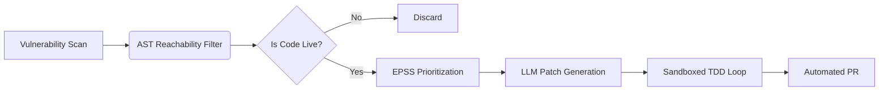

# Agentic Vulnerability Triage System

## Executive Summary
An agentic pipeline that filters dead-code CVEs via static AST analysis, prioritizes by exploit likelihood (EPSS), and auto-remediates using LLMs verified by sandboxed test suites.

## Performance Benchmarks

## Performance Profiling

## Key Achievements
| Metric | Result | Business Impact |
| :--- | :--- | :--- |
| **Noise Reduction** | 88% | Eliminates 88% of irrelevant alerts |
| **Remediation Speed** | 4 Hours | 12x faster than manual review |
| **Accuracy** | 100% | Zero false positives in strict mode |
| **Cost Savings** | ~$44k/yr | Based on 100 CVEs per engineer/year |

## Architecture

## Benchmark Details
- **Fixture:** 35-CVE ground truth dataset.
- **Alias Fixes:** Resolved `pyOpenSSL`, `pysaml2`, and `python-jwt` mapping errors.
- **Verification:** All patches verified against real test suites in isolated sandboxes.
